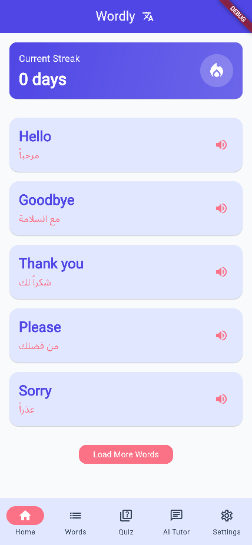
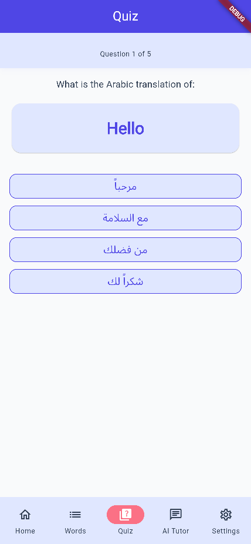
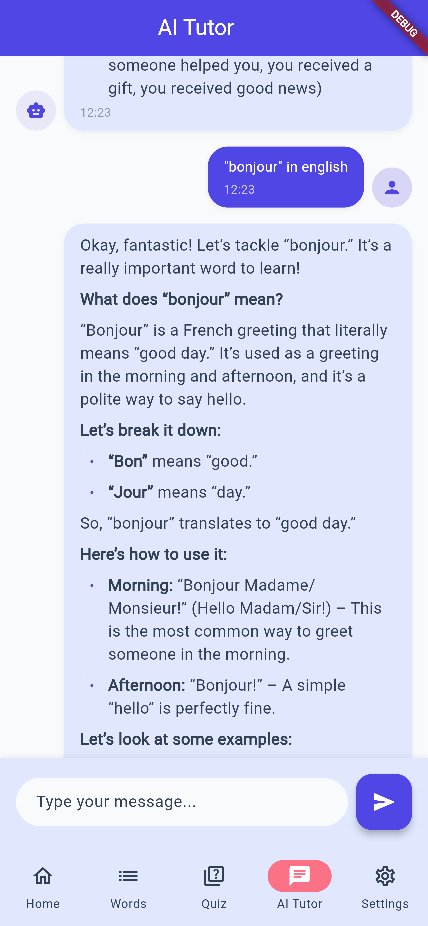
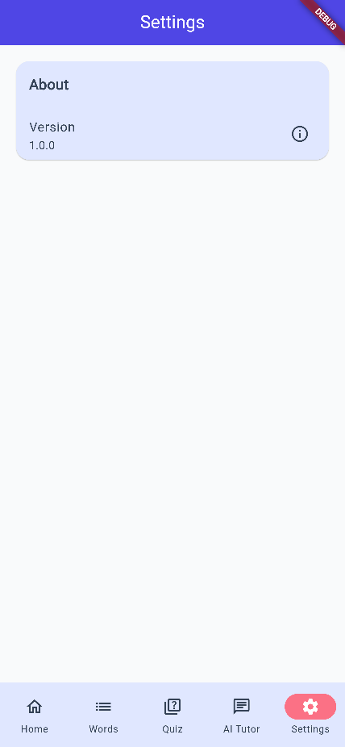

# Wordly - Application d'Apprentissage de Langues

Wordly est une application mobile moderne d'apprentissage des langues, développée avec Flutter, qui permet aux utilisateurs d'apprendre de nouveaux mots de manière interactive et engageante. Ce projet est aligné avec notre initiative d'innovation appelée FaseeH, une application communautaire dédiée à l'apprentissage linguistique.

## 🌟 Fonctionnalités Principales

### 📚 Apprentissage Quotidien
- 5 nouveaux mots par jour (extensible)
- Traductions en anglais et en arabe
- Prononciations
- Exemples de phrases

### 🎯 Quiz Interactif
- Questions basées sur les mots appris
- Feedback immédiat
- Suivi des performances
- Interface intuitive et engageante

### 💬 Assistant IA
- Chat interactif avec un tuteur IA
- Réponses en anglais et en arabe
- Support du formatage Markdown
- Interface de chat moderne et réactive

### 📊 Suivi des Progrès
- Compteur de séries quotidiennes
- Statistiques d'apprentissage
- Historique des mots appris

## 🛠️ Technologies Utilisées
- Flutter
- Provider (Gestion d'état)
- Google Gemini AI
- Shared Preferences
- Flutter Markdown
- Intl (Internationalisation)

## 📱 Captures d'Écran

### Écran Principal


*Liste des mots quotidiens avec traductions et exemples*

### Quiz


*Interface du quiz avec questions et réponses*

### Chat IA


*Interface de chat avec le tuteur IA*

### Paramètres


*Paramètres de l'application et préférences*

## 🚀 Installation

1. Clonez le repository :
```bash
git clone https://github.com/votre-username/wordly.git
```

2. Installez les dépendances :
```bash
flutter pub get
```

3. Créez un fichier `assets/.env` à la racine du projet et ajoutez votre clé API Gemini :
```
GEMINI_API_KEY=votre_clé_api
```

4. Lancez l'application :
```bash
flutter run
```

## 📝 Configuration

L'application nécessite une clé API Gemini pour le chat IA. Vous pouvez obtenir une clé sur le [Google AI Studio](https://makersuite.google.com/app/apikey).